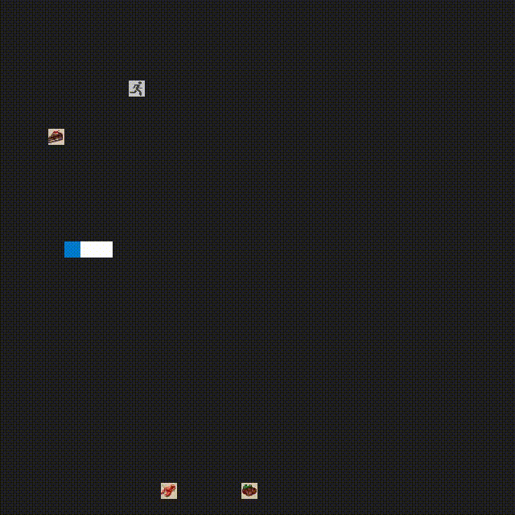

# CPPND: Capstone Snake Game Project
This is a Snake game modified from the [original Udacity repository](https://github.com/udacity/CppND-Capstone-Snake-Game) with additional feature:
* Foods with different functions
* Foods disappear over time

original vs. new

This project follows the requirements of the [rubric points](https://review.udacity.com/#!/rubrics/2533/view).
## Additional Dependencies for Running Locally
* SDL2-image
  * libsdl2-image-dev: [Click here for installation instructions](https://lazyfoo.net/tutorials/SDL/06_extension_libraries_and_loading_other_image_formats/index.php)
## Basic Build Instructions
1. Clone this repo.
2. Make a build directory in the top level directory: `mkdir build && cd build`
3. Compile: `cmake .. && make`
4. Run it: `./SnakeGame`.
## File and Class Structure
Each type of food provides different function. And each food has its existing life period related with snake's speed, which increases with higher score. When snake hit its own body or its body shrinks to the limit, the game is over.

> 1. Another way to copy a class with mutex member is to customize copy and assignment constructor as [this reference](https://stackoverflow.com/questions/49500419/how-to-use-a-mutex-as-a-member-variable-without-copy-constructor-of-simple-enc), and [this tutorial](https://chenlen.com/tag/thread-safe-copy-constructor/) but without deep copying SDL_Texture because not needed. When I tried this approach, **dead lock** still happened when calling move assignment.
> 2. For deep copying SDL_Texture, shared pointer is suggested in the [forum](http://forums.libsdl.org/viewtopic.php?p=42950).

## Rubric points addressed
### Object Oriented Programming
> * The project uses Object Oriented Programming techniques: The project code is organized into classes with class attributes to hold the data, and class methods to perform tasks.
> * Classes use appropriate access specifiers for class members: All class data members are explicitly specified as public, protected, or private.

Use Task class to store the texture and its control parameters. And the methods not intended to call by user are specified as private methods. (`task.cpp` line #18 to #51)  
> * Class constructors utilize member initialization lists: All class members that are set to argument values are initialized through member initialization lists.

The position are initialized through initialization list because it is the user order and the class does not checked the range, but the duration is checked in the constructor. (`task.cpp` line #3 to #6)

> * Classes abstract implementation details from their interfaces: All class member functions document their effects, either through function names, comments, or formal documentation. Member functions do not change program state in undocumented ways.

Every method is commented, as long as some change state logic in the method. (`task.cpp` line #3, #14)

> * Classes encapsulate behavior: Appropriate data and functions are grouped into classes. Member data that is subject to an invariant is hidden from the user. State is accessed via member functions.

Use getter and setter, as long as `FadeOut()` to access the states. (`task.h` line #28 to #39)

> * Overloaded functions allow the same function to operate on different parameters: One function is overloaded with different signatures for the same function name.

Overloaded `Game::PlaceFood()`. (`game.cpp` line #53 to #77)
### Memory Management
> * The project follows the Rule of 5: For all classes, if any one of the copy constructor, copy assignment operator, move constructor, move assignment operator, and destructor are defined, then all of these functions are defined.

Destructor is modified for freeing texture image memory and stop async task, so other 4 is also defined. (`task.cpp` line #17 to #67)
### Concurrency
> * The project uses multithreading: The project uses multiple threads in the execution.
> * A promise and future is used in the project: A promise and future is used to pass data from a worker thread to a parent thread in the project code.

For each Task object, an async task is running as down counter to control the texture fade out effect. (`task.cpp` line #132, #145 to #163)

> * A mutex or lock is used in the project: A mutex or lock (e.g. `std::lock_guard` or `std::unique_lock`) is used to protect data that is shared across multiple threads in the project code.

`std::lock_guard` is used When down counter changes the transparency while renderer reads it to control the fade out effect, as well as other private attributes are read by user. (`task.cpp` line #151, #171, #178, #184)
## Reference
### SDL2
* [Lazy Foo' SDL Tutorials](https://lazyfoo.net/tutorials/SDL/index.php)
* [Parallel Realities's Tutorials](https://www.parallelrealities.co.uk/tutorials/#shooter)
* [SDL homepage](https://www.libsdl.org/)
* [Text book: The Game Loop and Game Class](https://www.informit.com/articles/article.aspx?p=2928180&seqNum=4)
### Other c++ project idea
* [OpenCV projects](https://learnopencv.com/deep-learning-based-object-detection-using-yolov3-with-opencv-python-c)
* [Embedded system projects](https://1000projects.org/projects/embeddedsystemprojects)
* [OOP projects](https://www.codewithc.com/tag/cpp-mini-projects/)

## CC Attribution-ShareAlike 4.0 International

Shield: [![CC BY-SA 4.0][cc-by-sa-shield]][cc-by-sa]

This work is licensed under a
[Creative Commons Attribution-ShareAlike 4.0 International License][cc-by-sa].

[![CC BY-SA 4.0][cc-by-sa-image]][cc-by-sa]

[cc-by-sa]: http://creativecommons.org/licenses/by-sa/4.0/
[cc-by-sa-image]: https://licensebuttons.net/l/by-sa/4.0/88x31.png
[cc-by-sa-shield]: https://img.shields.io/badge/License-CC%20BY--SA%204.0-lightgrey.svg
